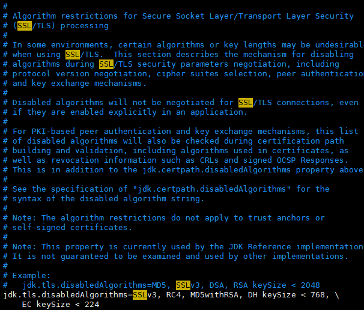
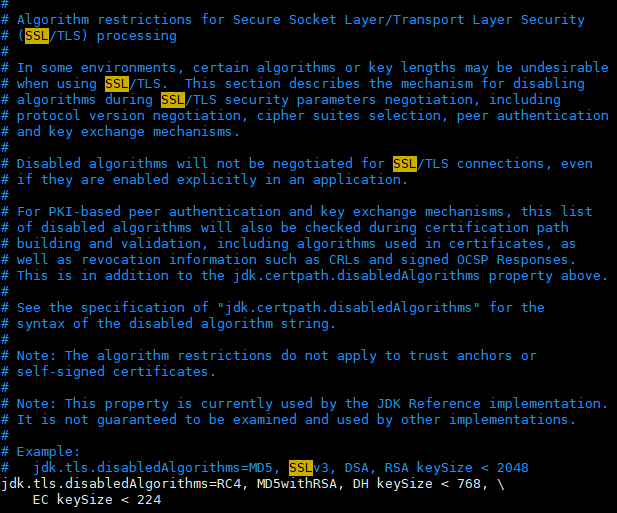

# Modify configs for SSL connections in JDK 8

## PROBLEM DESCRIPTION
MySQL/Redis in cloud services could be configured as SSL only, which prevents the Java server connect MySQL/Redis without SSL configuration. In addition to SSL connection properties in the Java Server Process, we should modify the configuration in JRE.

## SOLUTION
Edit `jdk.tls.disabledAlgorithms` configuration in `java.security`(Path maybe `/etc/alternatives/jre_1.8.0_openjdk/lib/security/java.security` in Centos 7), remove `SSL` or `TLS` if exists.

##### Before

##### After

## REFERENCE

1. [JDK8版本过高引起MySQL连接失败](https://juejin.cn/post/6969142310718144520)