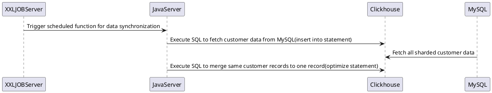

# Clickhouse实现多表联合查询

## 简介

现有一个用户画像系统，需要存储会员信息。其中有一个对系统中存在的所有会员进行多维度查询。由于基于会员存在分库分表的考虑以及用户画像系统所使用的技术栈，预定会员信息将汇集在Clickhouse中。本文将提供几种可行的实现方式，以及各种实现方式耗费的资源对比。基于下文优化后，会员列表查询响应时间可优化至1s左右。

当前使用的持久化组件：MySQL、Clickhouse、Storage Service(Delta Lake格式)

## 问题描述

现有三个会员信息表：customer、customer_identity、customer_channel_relation，以及渠道信息表channel。会员列表需求列举如下：
1. 支持对customer表信息的分页查询
2. 避免出现重复会员记录的情况（Clickhouse在merge前不处理记录合并）
3. 支持customer关联customer_identity的会员手机号查询
4. 支持customer关联customer_channel_relation的会员渠道关联查询
5. 支持customer关联customer_channel_relation及channel的会员品牌关联查询
6. channel表记录个数在20以内
7. customer、customer_identity、customer_channel_relation、channel表存在一个定时任务从MySQL将记录抽取至Clickhouse


8. customer表需要支持千万级数据
9. customer、customer_identity、customer_channel_relation、channel表的表引擎都是ReplicatedReplacingMergeTree

customer_identity表结构简述如下:
| Name               | Type | Description                                                     |
| ------------------ | -------- | ------------------------------------------------------------ |
| customer_id         | Int64   | |
| identity_type       | String   | 身份标识类型，枚举：(wechat_union_id, wechat_open_id, mobile, email, etc..) |
| identity_id       | String   | 身份值 |

customer_channel_relation表结构简述如下:
| Name               | Type | Description                                                     |
| ------------------ | -------- | ------------------------------------------------------------ |
| customer_id      | Int64   | |
| channel_id       | Int64   | 关联的渠道id |

channel表结构简述如下:
| Name               | Type | Description                                                     |
| ------------------ | -------- | ------------------------------------------------------------ |
| id      | Int64   | 渠道id |
| brand_id       | Int64   | 关联的品牌id |

### 需要考虑的指标
1. 会员列表的查询时间
2. 会员列表的optimize数据合并操作时间

## 针对手机号的查询处理
由于customer_identity的(identity_type, identity_id)在业务上全局唯一，即会员的手机号在系统内至对应一个会员，所以该查询在MySQL做查询索引处理即可，响应时间在500ms以内。

## 如何避免出现重复会员记录的情况
基于Clickhouse官网的描述(https://clickhouse.com/docs/en/sql-reference/statements/alter/update/)，update操作不被建议使用，所以会员信息同步是基于批量insert into + optimize的形式。但在optimize操作前，会出现单个会员的多个数据版本的情况，在会员列表中体现为一页中展示多个相同会员的不同版本。此处提出的解决方案是，每个会员记录增加一个写入clickhouse时的时间戳(下文中统一使用`__inserted_at`字段)，基于对Clickhouse中对customer表的optimize操作记录查询来确认最后一次optimize操作的执行时间，分页查询时增加对该字段的查询条件。


##### 查询会员表最后的optimize操作时间
```sql
select toUnixTimestamp(max(event_time)) 
from clusterAllReplicas(`{defaultCluster}`, view(select event_time from `system`.query_log
        where `type` = 'QueryFinish'
          and query_kind = ''
          and has(tables, 'customer')
          and query like '%optimize%'
        order by event_time desc limit 1))
```


## 针对customer、customer_channel_relation、channel的查询处理
方案1：customer、customer_channel_relation、channel直接做连表查询
方案2：基于数据同步过程维护ReplacingMergeTree，实现单表查询
方案3：基于数据同步过程维护AggregatingMergeTree视图，实现单表查询
方案4：只查询customer，对于customer_channel_relation的关联查询做其他处理

### 方案1
直接按条件做连表查询
```sql
select customer.* from customer 
left join customer_channel_relation on customer_channel_relation.customer_id = customer.id
left join channel on customer_channel_relation.channel_id = channel.id
where
-- 查询条件根据请求变动
customer_channel_relation.channel_id = {channel_id}
and 
channel.brand_id = {brand_id}
and
-- 避免出现重复会员记录
customer.__inserted_at <= {optimized_at}
limit 0, 15
```

优点：不需要维护其他表或数据结构
缺点：两表数据都在千万级，做笛卡尔积后需要占用集群10GB RAM，查询时间在20秒左右

### 方案2
由于连表查询效率无法令人接受，此处在数据同步时维护一个会员信息的集合表customer_query_view

customer_query_view表结构简述如下(省略customer表字段):
| Name               | Type | Description                                                     |
| ------------------ | -------- | ------------------------------------------------------------ |
| channel_ids     | Array(Int64)   | 会员关联的渠道id数组 |
| brand_ids       | Array(Int64)   | 会员关联的品牌id数组 |

```sql
select * from customer_query_view
where
-- 查询条件根据请求变动
has(channel_ids, {channel_id})
and 
has(brand_ids, {brand_id})
and
-- 避免出现重复会员记录
__inserted_at <= {optimized_at}
limit 0, 15
```

优点：相比方案一，查询在单表内完成，查询时间优化至5秒左右
缺点：数据同步时需要维护集合表，该集合表在optimize时会出现超过3分钟的情况，对数据实时性造成很大影响，影响{optimized_at}的更新时间

### 方案3
类似于方案2，但每个会员记录只保留一个关联的渠道及品牌信息，查询结果用聚合函数处理

customer_query_view表结构简述如下(省略`__inserted_at`):
| Name               | Type | Description                                                     |
| ------------------ | -------- | ------------------------------------------------------------ |
| {column in Customer}     | AggregateFunction(argMaxIf, {column type}, DateTime64, UInt8)   | customer表字段需保存中间态 |
| channel_ids     | SimpleAggregateFunction(groupArrayArray, Int64)   | 会员关联的渠道id数组 |
| brand_ids       | SimpleAggregateFunction(groupArrayArray, Int64)   | 会员关联的品牌id数组 |

```sql
select 
    id     UInt64,
    __inserted_at AggregateFunction(max, DateTime64),
    {column in Customer}    AggregateFunction(argMaxIf, {column type}, DateTime64, UInt8)
from customer_query_view
where
-- 查询条件根据请求变动
has(channel_ids, {channel_id})
and 
has(brand_ids, {brand_id})
limit 0, 15
```

优点：相比方案一，查询在单表内完成，查询时间优化至3秒左右。且不需要单独对`__inserted_at`做查询
缺点：与方案2相似，该集合表在optimize时会出现超过3分钟的情况，对数据实时性造成很大影响，影响{optimized_at}的更新时间

### 方案4

由于方案2和3都在optimize上耗费相当多的时间，此方案放弃维护会员信息聚合表，将需要连表查询的查询条件{channel_id}和{brand_id}在独立表上预处理bitmap聚合

customer_query_aggregation表结构简述如下:
| Name               | Type | Description                                                     |
| ------------------ | -------- | ------------------------------------------------------------ |
| query_type  |  String  | "channel_id" or "brand_id" |
| obj_id     | Int64   | value of query_type |
| customer_ids       | AggregateFunction(groupBitmap, Int64)   | 符合该条件的会员id bitmap |

```sql
select 
    *
from customer
where
-- 查询条件根据请求变动
bitmapContains(
    (
        select customer_ids 
        from customer_query_aggregation
        where query_type = "channel_id" and obj_id = {channel_id}
    ), 
    id
)
and 
bitmapContains(
    (
        select customer_ids 
        from customer_query_aggregation
        where query_type = "brand_id" and obj_id = {brand_id}
    ), 
    id
)
and
-- 避免出现重复会员记录
__inserted_at <= {optimized_at}
limit 0, 15
```

优点：相比方案二和三，查询在单表内完成，查询时间优化至1秒左右。且optimize操作可以控制在20s左右
缺点：可拓展性相比方案一差，如果需要添加查询条件，需要在customer_query_aggregation表中维护更多的查询条件记录

## 结论

本文实现了对千万级会员列表平均2s响应的查询，但由于Clickhouse没有对千万级数据的分页方案，翻页查询offset超过800万个记录后依然会出现查询超时情况，在后续讨论翻页设计时需考虑Clickhouse的设计瓶颈，对于此类需求可能使用Elasticsearch更为适配。

## 参考
1. [Clickhouse官方文档](https://clickhouse.com/docs/en/)
