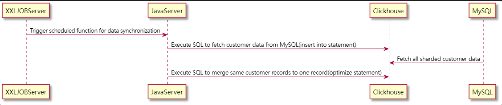
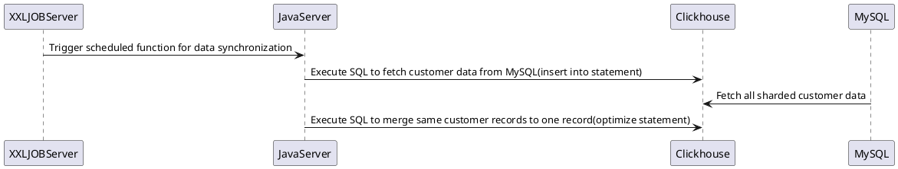

# Multi-table related query in ClickHouse

## INTRODUCTION

We have a tagging system storing tens of millions of customer data and expected to take 3 seconds to query customers with criteria across multiple tables. Because the current system design includes ClickHouse and MySQL, the following approaches in this article would use Clickhouse to implement the customer query. And one of the following approaches processes the customer query in 1 second.

## PROBLEM DESCRIPTION

Based on customer data sharded in MySQL, customer data would be synchronized from MySQL to ClickHouse regularly.




Given four customer information related tables: customer, customer_identity, and customer_channel_relation, and the channel table which stores the relation between channels and brands, the solution must meet the following requirements:

1. Support paging query.
2. Avoid duplicated customer records.
3. Support query customer's mobile phone number in customer_identity.
4. Support query customer by channel id and brand id in customer_channel_relation and channel.
5. Tables in ClickHouse mentioned above(customer, customer_identity, customer_channel_relation, and channel) use ReplicatedReplacingMergeTree table engine.

#### customer_identity
| Name               | Type | Description                                                     |
| ------------------ | -------- | ------------------------------------------------------------ |
| customer_id         | Int64   | |
| identity_type       | String   | identity type for multi-channel customer matching(wechat_union_id, wechat_open_id, mobile, email, etc..) |
| identity_id       | String   | identity value for multi-channel customer matching |

#### customer_channel_relation
| Name               | Type | Description                                                     |
| ------------------ | -------- | ------------------------------------------------------------ |
| customer_id      | Int64   | |
| channel_id       | Int64   | channel id related to the customer |

#### channel
| Name               | Type | Description                                                     |
| ------------------ | -------- | ------------------------------------------------------------ |
| id      | Int64   | channel id |
| brand_id       | Int64   | brand id |

### Metrics that the solution needs to compare:
1. The customer query time
2. Data synchronization time from MySQL to ClickHouse

## TRICKS BEFORE SOLUTIONS COMPARING

### Special handling for query by mobile phone
Due to each mobile phone relating to at most one customer, a query with a mobile phone only needs to return at most one customer. It's possible to query the mobile phone in MySQL before requesting ClickHouse.

### Avoiding duplicated customer records in pagination
Based on the ClickHouse official document(https://clickhouse.com/docs/en/sql-reference/statements/alter/update/), using the update statement in data synchronization is not a good practice. So we use the insert and the optimize statement in current data synchronization. 
Before the optimization progress, it's possible to get multiple customer records in the customer query. We can add a timestamp column to the customer table in ClickHouse to remember when inserting(Hereinafter collectively referred to as `__inserted_at`). And we can avoid the customer records before being optimized by filtering the customer records before being optimized.

#### Querying the latest Optimization finished time
```sql
select toUnixTimestamp(max(event_time)) 
from clusterAllReplicas(`{defaultCluster}`, view(select event_time from `system`.query_log
        where `type` = 'QueryFinish'
          and query_kind = ''
          and has(tables, 'customer')
          and query like '%optimize%'
        order by event_time desc limit 1))
```

## APPROACHES FOR REST JOB
1. Joining customer, customer_channel_relation, and channel.
2. Combining customer, customer_channel_relation, and channel data in one table in ClickHouse with ReplacingMergeTree engine.
3. Aggregating customer, customer_channel_relation, and channel data in one materialized view in ClickHouse with AggregatingMergeTree engine.
4. Aggregating channel ids and brand ids to bitmaps and paging in customer table.

### APPROACH 1
```sql
select customer.* from customer 
left join customer_channel_relation on customer_channel_relation.customer_id = customer.id
left join channel on customer_channel_relation.channel_id = channel.id
where
-- param passed from the query request
customer_channel_relation.channel_id = {channel_id}
and 
channel.brand_id = {brand_id}
and
-- avoid duplicated customer record
customer.__inserted_at <= {optimized_at}
limit 0, 15
```

Advantages: No other table in the approach.
Disadvantages: It costs 10GB RAM to do the join query. And the customer query spent 20 seconds.

### APPROACH 2
Create a customer_query_merge_tree table in ClickHouse to make the paging query only in one table. Insert data into this table during synchronization.

#### customer_query_merge_tree
| Name               | Type | Description                                                     |
| ------------------ | -------- | ------------------------------------------------------------ |
| other columns in customer | | |
| channel_ids     | Array(Int64)   | channel id array related to customer  |
| brand_ids       | Array(Int64)   | brand id array related to customer  |

```sql
select * from customer_query_merge_tree
where
-- param passed from the query request
has(channel_ids, {channel_id})
and 
has(brand_ids, {brand_id})
and
-- avoid duplicated customer record
__inserted_at <= {optimized_at}
limit 0, 15
```

Advantages: Make the paging query in one table. The customer query spent 5 seconds.
Disadvantages: More insertion during synchronization, spent more than 3 minutes finishing the optimization.

### APPROACH 3
Create a customer_query_view materialized view in ClickHouse to make the paging aggregated query only in one table. Insert data into this table during synchronization.

#### customer_query_view
| Name               | Type | Description                                                     |
| ------------------ | -------- | ------------------------------------------------------------ |
| {columns in Customer}     | AggregateFunction(argMaxIf, {column type}, DateTime64, UInt8)   | columns in customer must declared as AggregateFunction |
| channel_ids     | SimpleAggregateFunction(groupArrayArray, Int64)   | customer relates channel id array |
| brand_ids       | SimpleAggregateFunction(groupArrayArray, Int64)   | customer relates brand id array |

```sql
select 
    id     UInt64,
    __inserted_at AggregateFunction(max, DateTime64),
    {column in Customer}    AggregateFunction(argMaxIf, {column type}, DateTime64, UInt8)
from customer_query_view
where
-- param passed from the query request
has(channel_ids, {channel_id})
and 
has(brand_ids, {brand_id})
limit 0, 15
```

Advantages: Make the paging query in one table. The customer query spent 3 seconds.
Disadvantages: More insertion during synchronization, spent more than 60 seconds finishing the optimization.

### APPROACH 4
Approach 2 and 3 spent too much time on table optimization, so we gave up the big aggregated table and aggregated the query param only into Bitmap.

#### customer_query_aggregation

| Name               | Type | Description                                                     |
| ------------------ | -------- | ------------------------------------------------------------ |
| query_type  |  String  | "channel_id" or "brand_id" |
| obj_id     | Int64   | value of query_type |
| customer_ids       | AggregateFunction(groupBitmap, Int64)   | aggregated customer id bitmap |

```sql
select 
    *
from customer
where
-- param passed from the query request
bitmapContains(
    (
        select customer_ids 
        from customer_query_aggregation
        where query_type = "channel_id" and obj_id = {channel_id}
    ), 
    id
)
and 
bitmapContains(
    (
        select customer_ids 
        from customer_query_aggregation
        where query_type = "brand_id" and obj_id = {brand_id}
    ), 
    id
)
and
-- avoid duplicated customer record
__inserted_at <= {optimized_at}
limit 0, 15
```

Advantages: The customer query spent 1 second, and the optimization only spent 20 seconds.
Disadvantages: If it's necessary to add more query param, we have to add more additional bitmaps.

## CONCLUSION

We found a way to spend 1 second in the customer query with satisfied time usage in optimization. However, ClickHouse didn't support the paging query with the Offset parameter over 8 million. Perhaps it's more reasonable to use Elasticsearch for such paging query.

## REFERENCE
1. [Clickhouse official document](https://clickhouse.com/docs/en/)