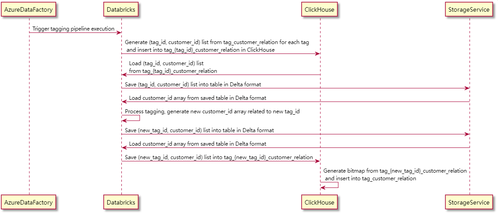
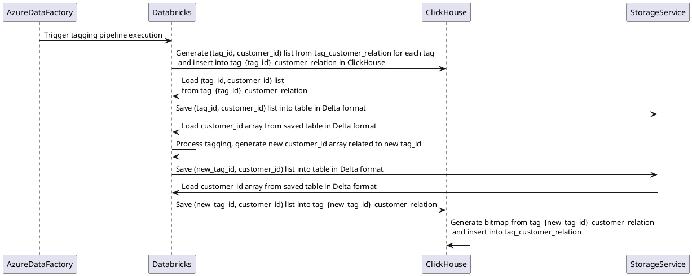
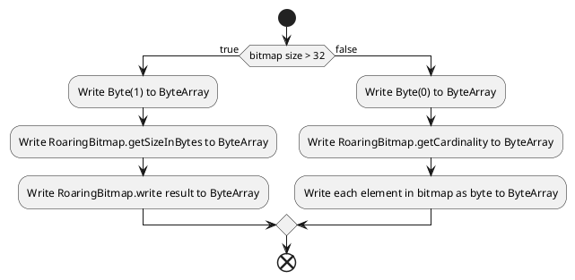
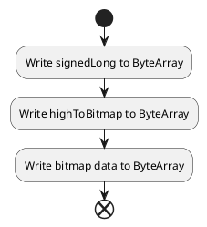
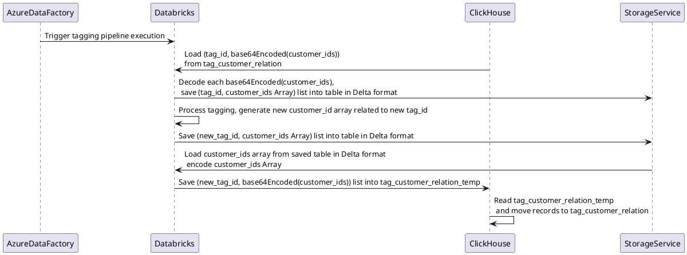

# Read & Write ClickHouse Bitmap in Databricks

## PROBLEM DESCRIPTION

We have a tagging system which expected to take 5 minutes for customer id bitmap generation, but the previous approach spent 70 minutes. By processing bitmap serialization directly, we now hit 2 minutes with ease.

With the previous approach, each customer id collection was parsed twice to support Union and Intersection between two customer id collections. It also spends lots of time in synchronization between ClickHouse and Databricks.





Customer tagging relation is saved as following schema(version column is ignored):
###### tag_customer_relation table in ClickHouse
| Name               | Type | Description                                                     |
| ------------------ | -------- | ------------------------------------------------------------ |
| tag_id             | Int64   | Business tag id, created in Java server                            |
| customer_ids       | AggregateFunction(groupBitmap, Int64)   | customer id collection which related to this tag|

```sql
CREATE TABLE tag_customer_relation_local ON CLUSTER `default_cluster` 
(
  tag_id Int64,
  customer_ids AggregateFunction(groupBitmap, Int64)
)
ENGINE = ReplicatedReplacingMergeTree('/ClickHouse/tables/{shard}/{uuid}', '{replica}') 
ORDER BY (tag_id)
SETTINGS index_granularity = 8192;

CREATE TABLE tag_customer_relation_distributed ON CLUSTER `default_cluster`
(
    tag_id Int64,
    customer_ids AggregateFunction(groupBitmap, Int64)
)
ENGINE = Distributed('default_cluster', 'default', 'tag_customer_relation_local', tag_id)
```

However, all customer_ids result was calculated in Databricks. Since "bitmap" in ClickHouse is not exist in Databricks, we have to flat map customer id collection related to tag_id, and save the Dataframe with the following schema into ClickHouse:
###### tag_{tag_id}_customer_relation Dataframe schema
| Name               | Type | Description                                                     |
| ------------------ | -------- | ------------------------------------------------------------ |
| tag_id             | Int64   | Business tag id, created in Java server       |
| customer_id          | Int64   | Member id related to this tag  |

Before processing the tag relation notebook in Databricks, each customer_id bitmap was mapped to tag_{tag_id}_customer_relation in ClickHouse and loaded by spark JDBC in Databricks.

## BITMAP IN ClickHouse

ClickHouse processing bitmap with CRoaring, but there is no Java implementation for CRoaring. We can look into how ClickHouse reads and writes bitmap:




ClickHouse doesn't provide API to create Bitmap from ByteArray in the current version, so we must insert Base64 encoded string into ClickHouse, and decode it in ClickHouse.

#### Write bitmap into ClickHouse
```sql
CREATE TABLE tag_customer_relation_local_temp ON CLUSTER `default_cluster` 
(
  tag_id Int64,
  customer_id_str String,
  customer_ids AggregateFunction(groupBitmap, Int64) 
                MATERIALIZED base64Decode(customer_id_str)
)
ENGINE = ReplicatedReplacingMergeTree('/ClickHouse/tables/{shard}/{uuid}', '{replica}') 
ORDER BY (tag_id)
SETTINGS index_granularity = 8192;

CREATE TABLE tag_customer_relation_distributed_temp ON CLUSTER `default_cluster`
(
    tag_id Int64,
    customer_id_str String,
    customer_ids AggregateFunction(groupBitmap, Int64)
                MATERIALIZED base64Decode(customer_id_str)
)
ENGINE = Distributed('default_cluster', 'default', 'tag_customer_relation_local_temp', tag_id)

insert into tag_customer_relation_distributed_temp(tag_id, customer_id_str) values ({tag_id}, {base64encodedBitmap})
insert into tag_customer_relation_distributed(tag_id, customer_ids) select tag_id, customer_ids from tag_customer_relation_distributed_temp
```

### Read bitmap from ClickHouse
```sql
select tag_id, base64encode(toString(customer_ids)) from tag_customer_relation_distributed
```


## BITMAP IN DATABRICKS

Roaring64NavigableMap is a Java Int64 bitmap implementation class preloaded in Databricks. It's reasonable to do serialization/deserialization with this class.




## APPROACH WITH ENCODED BITMAP




#### Serialization
```scala
import java.nio.ByteBuffer
import java.nio.ByteOrder
import java.io.DataOutputStream
import java.io.ByteArrayOutputStream
import org.roaringbitmap.longlong.Roaring64NavigableMap
import org.roaringbitmap.BitmapDataProvider
import io.opencensus.implcore.internal.VarInt
import java.util.TreeMap
import java.util.UUID
import java.util.Base64
import java.util.Properties
 
def toBase64Str(bf: ByteBuffer): String = {
  new String(Base64.getEncoder.encode(bf.array()))
}
 
def serialize(rb: Roaring64NavigableMap): String = {
    if (rb.getLongCardinality <= 32) {
      val length = 1 + 1 + 8 * rb.getIntCardinality
      val bos1 = ByteBuffer.allocate(length)
      val bos = if (bos1.order eq ByteOrder.LITTLE_ENDIAN) bos1 else bos1.slice.order(ByteOrder.LITTLE_ENDIAN)
      bos.put(new Integer(0).toByte)
      bos.put(rb.getIntCardinality.toByte)
      rb.toArray.foreach(i => bos.putLong(i))
      toBase64Str(bos)
    } else {
      // Roaring64NavigableMap serialize with prefix of "signedLongs" and "highToBitmap.size()"
      // Refer to the implementation of the serialize method of Roaring64NavigableMap, remove the prefix bytes
      // output bytes: Byte(1) + VarInt(rbTotalSize) + highToBitmap.size() + baos.toByteArray.slice(rbmPrefixBytes, serializedSizeInBytes)
      val rbmPrefixBytes = 1 + 4
      val serializedSizeInBytes = rb.serializedSizeInBytes().toInt
      val rbTotalSize = serializedSizeInBytes - rbmPrefixBytes + 8
      val varIntLen = VarInt.varLongSize(rbTotalSize)
      val length = 1 + varIntLen + rbTotalSize
      val bos1 = ByteBuffer.allocate(length)
      val bos = if (bos1.order eq ByteOrder.LITTLE_ENDIAN) bos1 else bos1.slice.order(ByteOrder.LITTLE_ENDIAN)
      bos.put(new Integer(1).toByte)
      VarInt.putVarInt(rbTotalSize, bos)
      val baos = new ByteArrayOutputStream()
      val rbClass = classOf[Roaring64NavigableMap]
      val field = rbClass.getDeclaredField("highToBitmap")
      field.setAccessible(true)
      val highToBitmap = field.get(rb).asInstanceOf[TreeMap[Integer, BitmapDataProvider]]
      bos.putLong(highToBitmap.size())
      rb.serialize(new DataOutputStream(baos))
      bos.put(baos.toByteArray.slice(rbmPrefixBytes, serializedSizeInBytes))
      toBase64Str(bos)
    }
  }
```

#### Deserialization
```scala
import java.nio.ByteBuffer
import java.nio.ByteOrder
import java.io.DataOutputStream
import java.io.ByteArrayOutputStream
import org.roaringbitmap.longlong.Roaring64NavigableMap
import org.roaringbitmap.BitmapDataProvider
import io.opencensus.implcore.internal.VarInt
import java.util.TreeMap
 
   
 
import java.sql.Statement
import java.sql.Connection
import java.sql.DriverManager
import java.sql.Timestamp
import java.time.Instant
import java.util.UUID
import io.delta.tables._
import org.apache.spark.sql.functions._
import spark.implicits._
import java.util.Base64
import java.nio.charset.StandardCharsets
import java.io.ByteArrayInputStream
import java.io.DataInputStream
import scala.math.BigInt
import scala.util.Try
 
def deserialize(input: String): Roaring64NavigableMap = {
  val byteArr = Base64.getDecoder().decode(input)
  val state = byteArr(0).intValue
  if (state == 0) {
    val bitmap = new Roaring64NavigableMap()
    val size = byteArr(1).intValue
    val arrSize = byteArr.size
    val byteBuffer = ByteBuffer.wrap(byteArr.slice(2, arrSize)).order(ByteOrder.LITTLE_ENDIAN)
    for (idx <- 1 to size) {
      bitmap.addLong(byteBuffer.getLong())
    }
    return bitmap
  } else {
    val intDest = Array.fill[Int](1)(0)
    val varInt = VarInt.getVarInt(byteArr, 1, intDest)
    val arrSize = byteArr.size
    val rbTotalSize = intDest(0)
    val varIntLen = VarInt.varIntSize(rbTotalSize)
    val bitmapStart = 1 + varIntLen + 8
    val byteArrOrder = ByteBuffer.wrap(byteArr.slice(1 + varIntLen, 1 + varIntLen + 8)).order(ByteOrder.LITTLE_ENDIAN)
    val highToBitmapSizeBytes = BigInt(byteArrOrder.getLong()).toByteArray.reverse.padTo(4,0).reverse.map( x => x.asInstanceOf[Number].byteValue )
    val bitmap = new Roaring64NavigableMap()
    val nextArr = Array[Byte](1) ++ highToBitmapSizeBytes ++ byteArr.slice(bitmapStart, arrSize)
    // val nextArr = Array[Byte](1) ++ byteArr.slice(1, arrSize)
    // val nextArrSize = byteArr.slice(bitmapStart, arrSize).size
    val bais = new ByteArrayInputStream(nextArr)
    bitmap.deserialize(new DataInputStream(bais))
    return bitmap
  }
}
```

** Both tested in Azure Databricks with Spark 2.4.5, ClickHouse 21.8

## CONCLUSION

The approach here is not an official way to create Bitmap in ClickHouse, so it makes ClickHouse version upgrading is being more complicated. Compared with the previous one, the approach here saves lots of time and io bandwidth, which is very helpful to optimize the execution of the tagging progress in Databricks.


## REFERENCES

1. [SparkSQL & ClickHouse RoaringBitmap使用实践](https://blog.csdn.net/qq_27639777/article/details/111005838)
2. [Bitmap read/write implementation in ClickHouse](https://github.com/ClickHouse/ClickHouse/blob/master/src/AggregateFunctions/AggregateFunctionGroupBitmapData.h#L112)
3. [SparkSQL & ClickHouse RoaringBitmap64格式支持](https://blog.csdn.net/fz1989/article/details/117222801)
